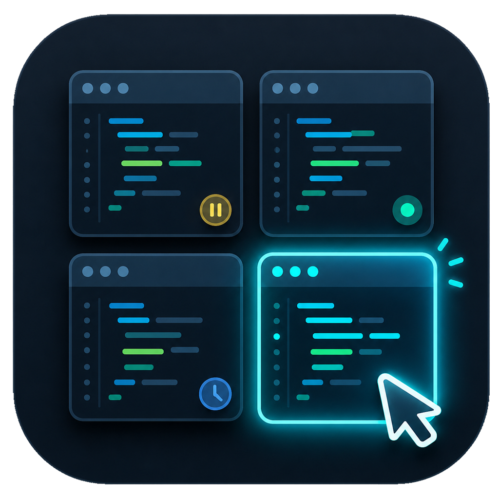

# VSCode Live Tiles



[日本語版 README](README.md)

A desktop widget that arranges live thumbnails of your VSCode windows as tiles
on a secondary monitor. Click a tile to move that window to your main monitor,
maximized and focused.

It uses the **DWM Thumbnail API** — the same mechanism as the taskbar hover
preview — so rendering is GPU-composited, real-time, and lightweight.

## Motivation

When you run multiple VSCode windows, each with its own Claude Code session in
parallel, some of them end up stuck on an approval prompt or a question — or
have long finished — without you noticing. The idle minutes pile up.

You could cycle through the windows to check, but that is exactly the kind of
friction you want to avoid while focused on another window. So this widget keeps
**the current state of every window visible at all times** on a secondary
monitor, one click away. It exists to minimize the time your sessions sit idle.

## Security & Privacy

Designed to be easy to audit and safe to leave running:

- **Zero network communication** — the codebase contains no networking code at all
- **Zero telemetry** — nothing is collected, nothing is sent anywhere
- **Zero NuGet dependencies** — .NET base class library only; Win32 API via
  hand-written P/Invoke
- **Read-only against your data** — the widget only reads `events.jsonl`;
  the only writer is the bundled Claude Code hook, which records the minimum
  needed for state detection (timestamp / event type / session ID / project
  name / cwd). **Prompts and tool inputs/outputs are never written**
- Logs stay local (`%LOCALAPPDATA%\VSCodeLiveTiles\logs\`, auto-deleted after 7 days)

## Resource Usage (measured)

Measured on the author's machine (v0.10.0, 2 monitors, 4 tiles, Windows 11):

| Metric | Value |
|---|---|
| Working Set (framework-dependent) | ~140 MB at launch / ~180 MB in steady use |
| Working Set (self-contained single exe) | ~243 MB at launch |
| CPU (60-second sample, average) | 0.05% (normalized to 16 cores; under 1% of a single core) |

Thumbnails are composited by DWM (the OS compositor), so the widget itself does
no per-frame rendering work.

## Requirements

- Windows 10 / 11
- .NET 10 Desktop Runtime (not needed if you use the self-contained single exe)

## Build & Run

```bash
dotnet build -c Release
dotnet run --project src/VSCodeLiveTiles          # debug run
# or publish (framework-dependent, for your own machine)
dotnet publish src/VSCodeLiveTiles -c Release -r win-x64 --self-contained false -o publish
# → run publish/VSCodeLiveTiles.exe

# distribution: fully self-contained single exe (~62 MB), no runtime required
dotnet publish src/VSCodeLiveTiles -c Release -r win-x64 --self-contained true `
  -p:PublishSingleFile=true -p:EnableCompressionInSingleFile=true `
  -p:IncludeNativeLibrariesForSelfExtract=true -o publish-standalone
```

On launch the widget occupies the **first non-primary monitor** full-screen and
lays out live tiles for all open VSCode windows. Clicking a tile **moves that
VSCode window to the primary monitor, maximized and brought to front**.

To quit, close the widget (Alt+F4).

## Running at Startup

Use the published `publish/VSCodeLiveTiles.exe` and place a shortcut in your
Startup folder (`shell:startup`).

- The dev build (`bin/`) and the resident exe (`publish/`) are separate, so
  `dotnet build` / `dotnet run` are never blocked while the widget is running
- **Update procedure**: close the widget (Alt+F4) → `dotnet publish ...` → relaunch
- To stop running at startup, just delete the `.lnk`

## Configuration (`appsettings.json`)

| Key | Default | Meaning |
|---|---|---|
| `targetProcessNames` | `["Code"]` | Target process names (without extension). Add more to tile other apps |
| `widgetMonitorIndex` | `null` | Monitor for the widget. `null` = first non-primary. Or an explicit index |
| `targetMonitorIndex` | `null` | Where clicked windows are maximized. `null` = primary. Or an explicit index |
| `refreshIntervalMs` | `1500` | Fallback polling interval backing the WinEvent hook. `0` to disable |
| `captionSuffixesToStrip` | `[" - Visual Studio Code", …]` | Suffixes removed from captions |

Monitor indices follow the `EnumDisplayMonitors` enumeration order (0-based).
If the widget appears on the wrong screen, set `widgetMonitorIndex` /
`targetMonitorIndex` explicitly.

## Claude Code Status Badges (v0.6+)

The bundled Claude Code hook (`hooks/append-event.mjs`) appends to
`~/.vscode-live-tiles/events.jsonl`, which the widget tails to show each
session's state on its tile.

### Setup (only if you want the badges)

```bash
node hooks/install.mjs           # registers the hook in ~/.claude/settings.json
node hooks/install.mjs --dry-run # preview the changes without writing
```

- Your settings are backed up to `settings.json.vscode-live-tiles.bak` first.
  Existing hooks (notification sounds etc.) are left untouched; only the
  append-event registration is replaced (safe to re-run)
- Restart the widget after installing (Claude Code picks the hook up
  immediately to at latest the next session)
- The hook is plain Node.js with zero dependencies. It always exits 0 —
  no failure of the hook can ever block Claude Code itself
- `events.jsonl` rotates at 5 MB (one generation kept as `events.jsonl.1`).
  Only the minimum needed for state detection is recorded (ts / type /
  sessionId / projectName / cwd) — never prompts or tool inputs/outputs

| Badge | State | Display |
|---|---|---|
| ❓ Question (yellow) | Stopped at AskUserQuestion | elapsed time + pulsing border |
| 🔑 Approval (orange) | Stopped at an approval dialog/notification | elapsed time + pulsing border |
| ✔ Done (green) | Response finished (stays until your next input) | badge only |
| ● Working (blue) | Running | badge only |

- Tiles are matched to sessions by whether the window caption ends with the
  folder name of the session's `cwd`. Unmatched tiles show no badge
  (no badge is better than a wrong badge)
- Only **waits you haven't looked at yet** pulse. Bringing that window to the
  front stops the pulsing. Claude Code has no hook that fires "at the moment
  of approval", so the waiting state clears only when the tool finishes
- `stop` does not necessarily mean done: if subagents or `run_in_background`
  Bash tasks are still running, the tile stays "Working"
  (detected via `background_tasks`)
- If `~/.vscode-live-tiles/` doesn't exist (hook not installed), the badge
  feature silently disables itself — everything else works as usual
- The widget is read-only (only the hook writes to events.jsonl). The path
  can be overridden with the `VSCODE_LIVE_TILES_EVENTS_FILE` environment
  variable (shared by hook and widget, restricted to under your home directory)

## Session Clock (v0.7+)

The caption bar shows `11:37 ▸ 5:23` (start time ▸ elapsed h:mm).

- Start time is the `session_start` timestamp. If `resume` fires it again,
  the **first observation** wins
- State is rebuilt from the last 512 KB of the file, but `session_start` is
  usually outside that window, so the widget scans the whole file once at
  startup just for `session_start` lines (measured: 24 MB in 64 ms; JSON is
  parsed only for matching lines)
- Sessions whose `session_start` was rotated away show no clock (no guessing)

## Design Notes

- DWM thumbnails are composited **on top of** the destination window's own
  rendering, so captions/borders live outside the thumbnail area
  (the bar at the bottom of each tile)
- Thumbnails don't receive input; clicks are caught via `WM_LBUTTONUP` on a
  child window under each thumbnail
- Minimized windows render an empty thumbnail, so tiles switch to a pure-WPF
  placeholder
- Tab switches (title changes) update the caption only, without recreating
  the thumbnail (prevents flicker)
- Per-Monitor v2 DPI aware; all coordinates are physical pixels

## Scope

Implemented so far: VSCode-only, automatic grid, click-to-move-and-maximize
(v0.4), Claude Code status badges (v0.6), session clock (v0.7).
Other apps can be tiled by adding to `targetProcessNames`.

## License

[MIT License](LICENSE)
